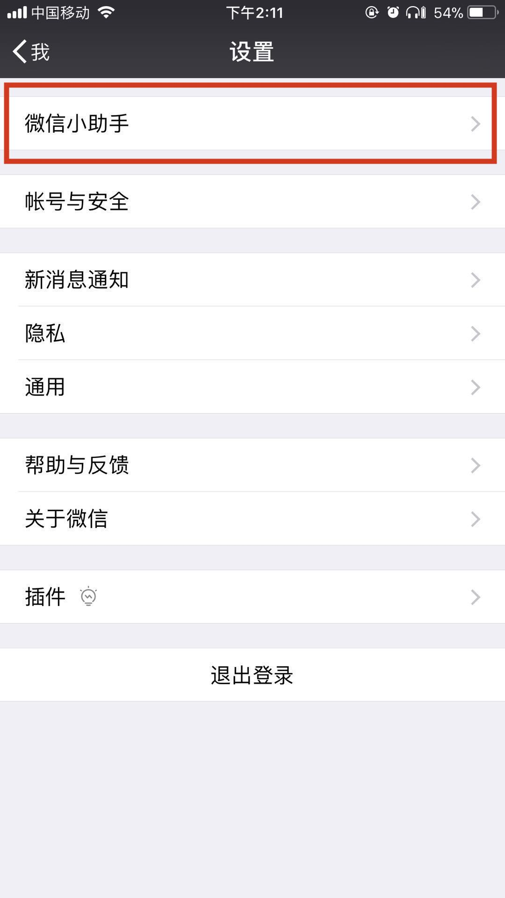
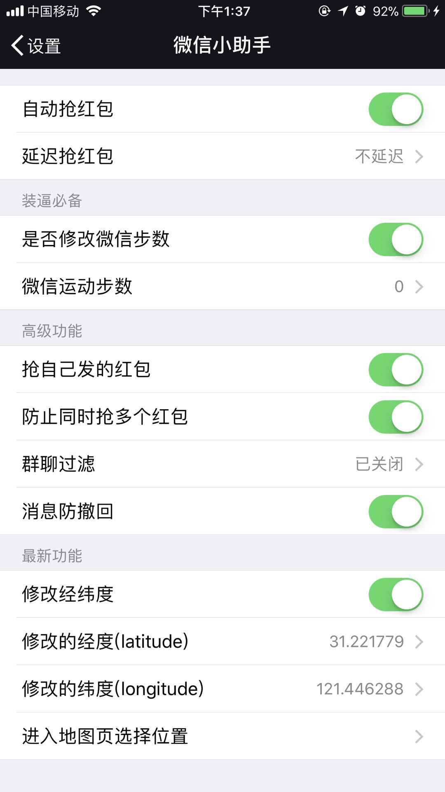

## WeChatPlugin-iOS

微信小助手-iOS版 v1.0.0

### 功能
- [x] 修改微信运动步数
- [x] 消息防撤回
- [x] 自动抢红包
- [x] 抢自己的红包
- [x] 防止多人同时抢红包
- [x] 群聊过滤
### 装逼新秀
- [x] 修改地理位置

### 截图

设置界面：

---

#### 0. 准备

* [ios-app-signer](https://github.com/DanTheMan827/ios-app-signer)  (重签名)
* Xcode 或者 PP助手 (安装ipa)
* iOS 证书(可用Xcode生成临时开发证书，然而只能用7天)
* APP文件(可直接下载下面百度云的app文件)

#### 1. 生成临时证书(~~若有证书忽略该步骤~~)
使用 Xcode 创建一个 iOS 的 Project，选择方框1 的开发者，并用真机运行(~~使证书导入到 iPhone~~)。

#### 2. 生成注入的app文件

* 可直接通过百度云下载
* * * old:链接:https://pan.baidu.com/s/1i6Z3Aw1  密码:5q8k(微信版本 6.6.1)
* * * new:链接:https://pan.baidu.com/s/1smjMyFN  密码:l0cj(微信版本 6.6.1,增加修改地理位置功能)
#### 3. 使用`iOS App Signer.app` 进行重签名

* `Input File` 选择上面的app文件。
* `Signing Certificate` 选择第一步中的开发者账号(方框3)
* `Provisioning Profile` 选择第一步中的`bundle id`(方框2)

点击start获得重签名的`ipa`文件。

#### 4. 使用 Xcode 安装 ipa

打开Xcode-Window-Devices，将重签名的ipa文件拖到方框中，或者点击`+`添加ipa，即可完成。

#### 5. iOS权限设置

打开`设置-通用-描述文件与设备管理`，信任证列表中的开发者应用。

### 免责声明
本项目旨在学习 iOS 逆向的一点实践，不可使用于商业和个人其他意图。若使用不当，均由个人承担。

---

#### 听说你想请我喝下午茶？😏

&nbsp;&nbsp;&nbsp;

